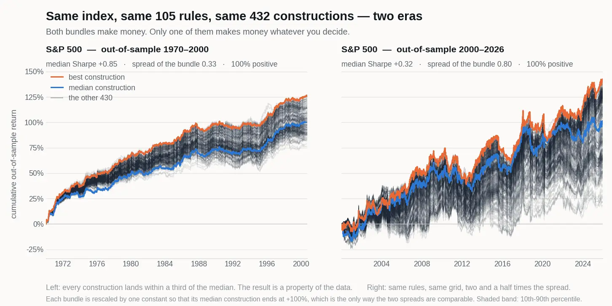

# walkforward-bundle

**Try it in your browser — no install:**
### [→ Bundle Tester](https://claude.ai/code/artifact/b82e101f-1498-4164-8e89-0320f8fd6ce9)

Drop in a price CSV, run every defensible walk-forward construction, and see
whether the bundle stays tight. Nothing is uploaded: the engine runs locally in
a Web Worker. Source in [`app/`](app/).

**The write-up:** [`paper/walkforward_bundle.pdf`](paper/walkforward_bundle.pdf) —
*The Walk-Forward Bundle: Specification-Curve Analysis for Trading-Strategy Validation.*



*Same index, same 105 candidate rules, same 432 walk-forward constructions, two
eras. Left, out-of-sample 1970-2000: every construction lands within a third of
the median — the result is a property of the data. Right, out-of-sample
2000-2026: the same method, two and a half times the spread — the result is
mostly a property of choices nobody can justify. Both bundles are positive in
100% of constructions, which is exactly why one curve tells you nothing. Each
bundle is rescaled by one constant so its median construction ends at +100%:
that is the only way two spreads are comparable.*

---

**A single walk-forward back-test is one sample from a distribution you never
looked at. This library shows you the distribution.**

You fit on a window, trade the window after it, and get an out-of-sample
equity curve. Honest work — except that the curve is also a function of the
window length, the re-selection frequency, the ranking metric and the
correlation cap, and nobody can justify those from first principles. Show one
curve and you have quietly run a search over construction choices and reported
the winner.

`walkforward-bundle` runs the whole grid of defensible constructions and hands
back every out-of-sample path. The question stops being *"how good is this
line?"* and becomes *"how tightly do these lines bundle?"*

---

## Install

```bash
pip install git+https://github.com/epiphanyalpha/walkforward-bundle.git

# with parallel execution and the analysis/plotting layer
pip install "walkforward-bundle[all] @ git+https://github.com/epiphanyalpha/walkforward-bundle.git"
```

The engine needs only `numpy`, `pandas` and `numba`. `scikit-learn`,
`matplotlib` and `seaborn` are pulled in by the `[analysis]` extra and imported
lazily, so a headless run never pays for them.

---

## See it work, in sixty seconds

No data, no API key, no download:

```bash
python -m validation.demo
```

It generates a price series with realistic texture and **no edge in it**,
sweeps 105 trend-following parameter sets over it, and runs all 432
walk-forward constructions across the result:

```
  candidates 105 parameter sets (annualized Sharpe -0.33 to 0.23, median -0.09)
  grid      432 walk-forward constructions

  ANNUALIZED OUT-OF-SAMPLE SHARPE, ACROSS THE GRID
      min   -0.79  ###
      q25   -0.38  #######
   median   -0.27  #########
      q75   -0.17  ##########
      max   +0.18  ##############

  positive in 5% of constructions   |   spread (sd) 0.16   |   15.8s

  best single construction   +0.18   sortino_WL48_Step12_Corr0.3_Cols5_TurnTrue_AnchFalse
  ensemble median            -0.27
```

Every candidate loses money after costs. The median construction loses money.
And **one construction out of 432 still prints a positive out-of-sample
Sharpe** — which is the one that would have made it into the deck.

Now point it at something real:

```bash
python -m validation.demo --csv spx_daily.csv --first-os 2000-01-01 --plot
```

Same 105 candidates, same 432 constructions, S&P 500 daily since 1927,
out-of-sample from 2000:

```
  candidates 105 parameter sets (annualized Sharpe 0.13 to 0.89, median 0.45)

      min   +0.06  #############
      q25   +0.23  ###############
   median   +0.33  ################
      q75   +0.38  #################
      max   +0.43  #################

  positive in 100% of constructions   |   spread (sd) 0.09

  marginal effect of each construction choice (median Sharpe):
    window_length  12=+0.33  24=+0.33  36=+0.33  48=+0.32
    step_months    3=+0.33  6=+0.34  12=+0.32
    anchored       False=+0.23  True=+0.38  <-- not a free choice
    metric_name    calmar=+0.32  sharpe=+0.34  sortino=+0.33
```

Positive in **every** construction, spread cut nearly in half, and the best
config only 0.10 above the median instead of 0.45. That is what a real — if
modest — edge looks like from the inside, and it is a different shape from the
first run in a way no single equity curve could have told you.

Both runs took under a minute. That is the whole argument for not picking one
curve.

*(No market data ships with this package. `--csv` takes any file with a date
column and a close column.)*

---

## Quickstart

```python
import numpy as np
import pandas as pd
from validation import FullBacktesterEnsemble, generate_config_list

# returns: rows = timestamps, columns = candidate strategies (or assets).
# turnover: same shape, same columns — traded notional per bar.
returns  = pd.read_pickle("candidates_returns.pkl")
turnover = pd.read_pickle("candidates_turnover.pkl")

grid = {
    "first_os":        ["2019-01-01"],   # first out-of-sample date
    "window_length":   [12, 24, 36, 48], # in-sample window, months
    "step_months":     [3, 6, 12],       # re-selection cadence == OOS length
    "anchored":        [True, False],    # expanding vs rolling
    "metric_name":     ["sharpe", "calmar", "sortino"],
    "max_corr":        [0.3, 0.5, 0.7],
    "max_columns":     [5, 10],
    "top_n":           [20],
    "risk_free_rate":  [0.0],
    "min_avg_trade":   [None],
    "include_turnover": [True],
}

ensemble = FullBacktesterEnsemble(
    returns, turnover, generate_config_list(grid),
    periods_per_year=252,      # 252 daily / 365 crypto / 24*365 hourly
)
results, oos_series = ensemble.run()

print(ensemble.summary())
```

```
n_configs             432.000     # annualized OOS Sharpe across the grid
sharpe_min             -0.227
sharpe_q25              0.381
sharpe_median           0.529
sharpe_mean             0.531
sharpe_q75              0.698
sharpe_max              1.199
sharpe_std              0.230
frac_positive           0.991
```

That is the deliverable. Not `1.20`.

Those numbers are real output from
[`examples/quickstart.py`](examples/quickstart.py), run on a **synthetic
universe with no edge in it** — random factors, dispersed drift, nothing to
find. The best configuration in the grid still returns an annualized OOS
Sharpe of 1.20. Reported alone, on a walk-forward, out-of-sample, with a
straight face.

The median says 0.53. The spread says the 1.20 was a draw from a distribution,
not a discovery.

```python
# every OOS path as a row -> plot them all, faintly, on one chart
paths = ensemble.paths()

# or drill into which axis is doing the work
from validation import plot_grouped_performance_boxplots
plot_grouped_performance_boxplots(results, ["window_length", "metric_name"])
```

---

## The candidate universe

Everything upstream of this library is your problem, and it is the part that
matters most. The input is a wide frame of **candidate return streams** — one
column per strategy, parameter set, asset, or (strategy x asset) pair.

`validation.datasets.candidate_matrix` is the reference implementation of
this format — a parameter sweep over one price series into an aligned
`(returns, turnover)` pair. Read it, or use it, or copy the twenty lines that
matter into your own pipeline.

The one non-negotiable requirement: **those columns must already be causal.**
If a candidate's P&L came from a model fit on the full history, the
walk-forward is choosing among candidates that have all seen the future, and
no amount of window discipline downstream repairs it. Generate the candidate
P&L causally first — then bring it here.

`turnover` is optional but wanted: it is what makes `avg_trade` (P&L per unit
of traded notional) available, which is the number that tells you whether the
edge survives contact with a cost assumption.

---

## What one configuration does

```
[ WalkForwardSchedule ]   windows (start, end), anchored or rolling
        |
        v
  for each window:
    [ InitialSelector ]      rank all candidates on the in-sample metric,
                             keep the best top_n
    [ CorrelationFilter ]    walk the shortlist best-first; drop anything
                             correlated >= max_corr with something already
                             kept; stop at max_columns
    [ min_avg_trade gate ]   optional floor on P&L per unit of turnover
        |
        v
    [ OutOfSampleTester ]    equal-weight the survivors over the NEXT
                             step_months; record returns and turnover
        |
        v
[ aggregate_oos ]         stitch the OOS legs into one continuous stream
```

The out-of-sample leg runs from `in_sample_end + 1 day` to
`in_sample_end + step_months`, so the selection window and the period it is
judged on never share a bar. The schedule stops `step_months` short of the end
of the data: a selection with no future to trade would be an unfalsifiable
opinion.

Full discussion in [`docs/METHODOLOGY.md`](docs/METHODOLOGY.md).

---

## Configuration reference

| key | type | meaning |
|---|---|---|
| `first_os` | date-like | boundary between the first in-sample window and the first OOS period |
| `window_length` | int | in-sample window length, **months** |
| `step_months` | int | re-selection cadence; also the length of each OOS leg |
| `anchored` | bool | `True` = expanding from a fixed start, `False` = rolling fixed-length |
| `metric_name` | str | key into `METRICS` — the in-sample ranking objective |
| `top_n` | int | how many candidates survive the ranking stage |
| `max_corr` | float | correlation cap in the de-correlation stage |
| `max_columns` | int | maximum candidates deployed in one OOS leg |
| `min_avg_trade` | float or None | floor on P&L per unit of turnover (needs `turnover`) |
| `risk_free_rate` | float | per-period, in the same units as the returns |
| `include_turnover` | bool | carry turnover through so `avg_trade` is reported |

### Metrics

| name | direction | reducible* |
|---|---|---|
| `sharpe` | higher better | yes |
| `volatility` | lower better | yes |
| `highest_return` | higher better | yes |
| `momentum` | higher better | yes |
| `max_drawdown` | lower better | no |
| `sortino` | higher better | no |
| `calmar` | higher better | no |
| `information_ratio` | higher better | no |
| `avg_trade` | higher better | no |
| `skewness` | higher better | no |
| `kurtosis` | lower better | no |

\* *reducible* = expressible from prefix sums of `x` and `x²`, and therefore
computed in `O(k)` per window instead of `O(T·k)`. See
[`docs/PERFORMANCE.md`](docs/PERFORMANCE.md).

Adding your own is one function plus an attribute:

```python
from validation import METRICS

def my_metric(data, risk_free_rate=0.0):     # data: (T, k) ndarray
    return np.nanmean(data, axis=0) / np.nanmax(np.abs(data), axis=0)
my_metric.ascending = False                  # higher is better

METRICS["my_metric"] = my_metric
```

The signature is inspected: name a parameter `risk_free_rate`, `lookback` or
`momentum_lookback` and it gets filled in automatically.

---

## Output

`ensemble.run()` returns `(results_df, oos_series)`.

**`results_df`** — one row per configuration, indexed by `config_key`, with
every input parameter plus `oos_cumulative_return`, `oos_volatility`,
`oos_avg_trade`, `n_oos_periods` and `run_time_sec`, and two Sharpe columns:

- `oos_sharpe` — **per period**, in the units of your input bars.
- `oos_sharpe_ann` — annualized with `periods_per_year`, which you set on the
  ensemble: `252` for daily bars, `365` for crypto, `24 * 365` for hourly.
  Getting this wrong is the most common way to be off by 16x, so both columns
  are reported and neither is named ambiguously.

**`oos_series`** — `config_key -> pd.Series` of the stitched out-of-sample
returns.

Helpers on the ensemble:

- `ensemble.summary()` — the spread of OOS Sharpe across the grid.
- `ensemble.paths()` — all OOS paths as a `configs x timestamps` frame.

Analysis layer (needs `[analysis]`):

```python
from validation import calculate_clusters, plot_grouped_equity_curves

clusters = calculate_clusters(ensemble.paths(), results, n_clusters=4)
plot_grouped_equity_curves(clusters["results_with_clusters"], oos_series, "cluster")
```

---

## Performance

The grid is embarrassingly parallel and embarrassingly redundant — most
configurations share most of their work. Exploiting the redundancy turns out
to matter more than exploiting the parallelism.

Instrumenting the v0.1 engine found **82.9% of the runtime in one line**: the
in-sample ranking metric, recomputed over the full `T x k` slice once per
window per configuration. Since `max_corr` and `max_columns` act *after* the
ranking, most of those evaluations were duplicates.

On a 5,000 x 1,000 universe with a 576-configuration grid:

| engine | seconds | vs legacy |
|---|---|---|
| legacy: `.loc` slicing + pairwise correlation loop | 45.7 | 1.0x |
| `FrameBundle` + per-window metric cache | **12.0** | **3.8x** |
| + prefix-sum moments | 12.4 | 3.7x |
| + `joblib`, 2 workers, chunked by schedule | 12.1 | 3.8x |

The metric cache is the whole story: 5,296 cache hits against 656 real
evaluations, and `45.3 x (0.171 + 0.829/9.1) = 11.9s` predicts the measured
12.0s almost exactly. The other three changes were worth about 4% between
them. Two cores is why the parallel row is flat — and the naive version of
that row, one task per configuration, runs at **0.6x**, *slower than serial*,
because it throws the cache away on every dispatch.

The full breakdown — what was slow, what fixed it, and the one optimisation
that lost to a plain dictionary — is in
[`docs/PERFORMANCE.md`](docs/PERFORMANCE.md).

```bash
python benchmarks/bench_engine.py --rows 5000 --cols 1000 --jobs 8
```

---

## Building blocks

Every stage is usable on its own:

```python
from validation import (
    FrameBundle,          # zero-copy slicing over the universe
    WalkForwardSchedule,  # just the window calendar
    SelectionUnit,        # rank + de-correlate one window
    OutOfSampleTester,    # evaluate one selection over one period
    FullBacktester,       # one complete configuration
)
```

```python
bundle = FrameBundle(returns, turnover)
schedule = WalkForwardSchedule(bundle, "2019-01-01", window_length=24, step_months=6)
print(len(schedule), schedule.get_slices()[:3])
```

---

## Changes in 0.2.0

**Fixed**

- `ensemble_backtester.py` did not parse. Stray `)` tokens, a duplicated
  import block and a missing `import logging` meant `from validation import
  FullBacktesterEnsemble` raised `SyntaxError` — the package's headline entry
  point was unreachable.
- **NaN candidates won the ranking.** `np.argsort(v)[::-1][:top_n]` parks NaNs
  at the end and the reversal moves them to the *front*, so any candidate with
  an undefined metric was selected first. Ranking is now non-finite-safe (and
  `±inf` is demoted too: an infinite Sharpe is a zero-variance artefact, not a
  winner).
- De-correlating an empty shortlist raised instead of returning nothing.
- `aggregate_oos` double-counted overlapping timestamps when stitching legs.
- `min_avg_trade` compared against `NaN` without masking, silently keeping
  candidates with zero turnover.

**Added**

- `python -m validation.demo` — a sixty-second, zero-setup demonstration.
- `validation.datasets` — synthetic price generation and `candidate_matrix`,
  the reference implementation of the input format.
- `FrameBundle` — the universe materialised once; every window is a
  `searchsorted` and a view.
- Per-window metric cache, shared across configurations.
- Prefix-sum fast path for moment-based metrics.
- `n_jobs` parallel execution, chunked by schedule so the cache survives.
- `ensemble.summary()` and `ensemble.paths()`.
- Test suite pinning the optimised paths to the naive implementations.

**Changed**

- `run()` returns `results_df` indexed by `config_key`.
- In-sample results are keyed by `(start, end)` timestamps rather than a
  formatted string.
- Analysis and plotting imports are lazy; core install is numpy/pandas/numba.

---

## License

MIT. Francesco Landolfi.
